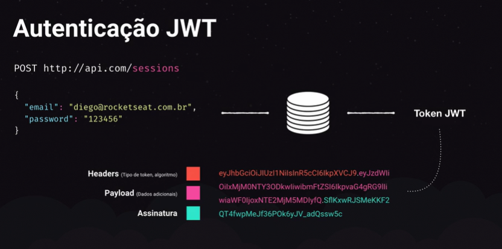

# Iniciando back end do gobarber

## Indice

  [00 Configurando estrutura](#00-configurando-a-estrutura)
  [01 Nodemon & Sucrase](#01-nodemon-&-sucrase)
  [02 Conceitos do Docker](#02-conceitos-do-docker)
  [03 Configurando o Docker](#03-configurando-o-docker)
  [04 Sequelize & MVC](#04-sequelize-&-MVC)
  [05 ESLint, Prettier & EditorConfig](05-eSLint-prettier-&-EditorConfig)

## 00 Configurando estrutura

  Objetivo: estruturar pastas e arquivos basicos da aplicacao.

  * (terminal) inicializa projeto: `yarn init -y` ;
  * (terminal) instala express: `yarn add express` ;
  * cria estrutura:

    src/
      app.js
      server.js
      routes.js

  * define arquivo **app.js**;
  * define arquivo **server.js**;
    * estrutura da aplicacao (app.js) separado do servidor e das rotas para facilitar trabalho com testes unitarios e de integracao que trabalha diretamente com a classe App;
  * define arquivo **routes.js** ;
  * (terminal) testa projeto: `node src/server.js` ;

## 01 Nodemon & Sucrase

  Objetivo: utilizar sintaxe de 'import' e 'export'com *sucrase*, automatizar acionamento do servidor com *nodemon* e adapta debugger para rodar com sucrase;

  * (terminal) instala sucrase e nodemon como dependencia de desenvolvimento: `yarn add sucrase nodemon -D`;
  * altera sintaxe de import e export nos arquivos:

    Imports:
    * de: const foo = require('Foo');
    * para: import foo from 'Foo';

    Exports:
    * de: module.exports = new Foo();
    * para: export default new Foo();

  * cria script personalizado 'dev' em **package.json** para rodar nodemon:

  ```
      "scripts": {
      "dev": "nodemon src/server.js"
    },
  ```

  * cria arquivo **nodemon.json** para que nodemon utilize sucrase-node ao inves de node:

  ```
  {
    "execMap: {
      "js": "node -r sucrase/register"
    }
  }
  ```
    ... para todo arquivo '.js' rode node mas antes, registre (-r) sucrase/register;

  * adiciona script em **package.json** para que debugger rode com *sucrase*:

    ```
    "scripts": {
      "dev": "nodemon src/server.js",
      "dev:debug":"nodemon --inspect src/server.js"
    },

    ```

  * cria nova configuracao na aba do bug do VSCode:

    aba bug > add configuration... > node.js e altera **launch.json**:

    de: "request": "launch"
    para: "request": "attach"

    deleta: "program": "${workspaceFolder}/index.js"
    cria: "protocol": "inspector"

    cria: "restart": true,

    cria: "skipFiles": [
            "<node_internals>/**",
            "${workspaceRoot}/node_modules/**/*.js"
          ],

  * testa debugger com: `yarn dev:debug`
  * ATENCAO: mantenha pasta *.vscode* para manter configuracoes do debugger com *sucrase*

## 02 Conceitos do Docker

  * Como funciona?

    * Funciona como um ambiente isolado na maquina (container);

    * Containers expoem portas para comunicacao. Ex.:

      App
        > :5432 (PostgreSQL)
        > :2707 (MongoDB)

  * Principais conceitos

    * Imagem: servico disponivel do docker. Tecnologias e ferramentas que podemos colocar em containers;

    * Container: instancia de uma imagem. Ex.: se imagem for PostGreSQL, podemos ter tres containers rodando esta imagem;

    * Docker Registry (Docker Hub): analogo ao npm do node, que contem os registros das dependencias em nuvem. O registro do docker é o docker register. Podemos até cadastrar nossas próprias imagens lá.

    * Dockerfile:

      * Receita de uma imagem: define como nossa aplicacao pode rodar em um ambiente a partir do zero. Ex.:


        ```
        # Partimos de uma imagem existente
        FROM node:10

        # Definimos a pasta e copiamos os arquivos
        WORKDIR /usr/app
        COPY . ./

        # Instalamos as depencias
        RUN yarn

        # Qual porta queremos expor?
        EXPOSE 3333

        # Executamos nossa aplicacao
        CMD yarn start

        ```

## 03 Configurando o Docker

  * Instala Docker CE

    * Navega para: https://docs.docker.com/install/
    * Seleciona sistema operacional e segue etapas. Em caso de windows: https://docs.docker.com/docker-for-windows/install/
    * Confere requisitos do sistema;
    * Faz download do Docker Desktop for Windows e faz instalacao;
    * (terminal) confere se foi instalado: `docker -v` ;
    * (terminal) lista todos os comandos: `docker help` ;

  * Cria servico de banco de dados PostGreSQL

    * Busca por 'docker postgres' no google;
    * Acessa: https://hub.docker.com/_/postgres;
    * Cria servico passando:
      * Nome do container: --name database
      * Password do container: -e POSTGRES_PASSWORD=docker
      * Redirecionamento de porta da porta da maquina para a porta do container: -p 5432:5432
      * (terminal) Comando: `docker run --name database -e POSTGRES_PASSWORD=docker -p 5432:5432`

      Obs: username padrao (postgres) nao precisa ser passado como parametro;

  * (terminal) Verifica se container esta rodando: `docker ps` ;

  * Instala PostBird (interface visual GUI para visualizar dados no banco de dados): https://electronjs.org/apps/postbird

  * Faz conexao com banco de dados utilizando PostHBird:

    * Host: localhost
    * Port: 5432
    * Username: postgres (default username)
    * Password: docker

    * Clica em 'Test Connection'
    * Clica em 'Save & Connect'

  * Cria nova database clicando em 'select database' > 'create database'

  * Renomeia database;

  * (terminal) Interrompe conexao com container: `docker stop database` ;

  * (terminal) Visualiza todos os containers que tem na maquina: `docker ps -a` ;

  * (terminal) Inicia conexao com container: `docker start database` ;

  * (terminal) Confere se container esta rodando: `docker ps` ;

  * (terminal) Visualiza log de erros do container: `docker logs database`

## 04 Sequelize & MVC

  * O que é Sequelize?

    * ORM para node.js para bancos de dados relacionais (sql);
    * Mesma sintaxe funciona para mySQL, PostGreSQL, SQLite;
    * Serve como tradutor de JS para query language;

  * O que é um ORM?

    * ORM: Object-relational mapping;
    * Uma forma de abstracao de banco de dados;
      * Muda forma com que nossa aplicacao se comunica com o banco de dados;

    * Considerando arquitetura MVC:
      * Tabelas viram models. Ex.:

      table users -> User.js
      table companies -> Company.js
      table projects -> Project.js

  * Manipulacao de dados

    * Nao usa INSERT nem UPDATE nem DELETE para manipulacao de dados, mas sim codigo JS.
    * Sequelize traduz JS para SQL no dialeto especificado no arquivo de configuracao. Ex:

    De:
    ```javascript
    User.create({
      name: 'Joao da Silva',
      email: 'joao@email.com.br',
    })
    ```

    Para:
    ```sql
    INSERT INTO users(name,email)
      VALUES (
        "Joao Silva",
        "joao@email.com.br"
      )
    ```

    Outro exemplo:

    De:
    ```javascript
    User.findOne({
      where: {
        email: 'joao@email.com.br'
      }
    })
    ```

    Para:
    ```sql
    SELECT *
    FROM users
    WHERE email = 'joao@email.com.br'
    LIMIT 1
    ```


  * Migrations

    * Controle de versao para base de dados;
    * Cada arquivo de migration contem instrucoes para criacao, alteracao ou remocao de tabelas ou colunas;
    * Mantem a base atualizada entre todos desenvolvedores do time e tambem no ambiente de producao;
    * Cada arquivo é uma migration e sua ordenação ocorre por data;

    Exemplo:

    ```javascript
    module.exports = {
      up:(queryInterface,Sequelize)=>{

        // Instrucao para criar nova tabela
        return queryInterface.createTable('users',{

          // Criacao de 3 campos com suas propriedades.
          // O ID é a chave primária e auto incremental.
          id:{
            allowNull: false,
            autoIncrement: true,
            primaryKey: true,
            type: Sequelize.INTEGER
          },
          name:{
            allowNull: false,
            type: Sequelize.STRING
          },
          email:{
            allowNull:false,
            unique: true,
            type: Sequelize.STRING
          }
        })
      },

      down: (queryInterface,Sequelize)=>{

        // Instrução para deletar a tabela caso haja um rollback
        return queryInterface.dropTable('users')
      }
    }
    ```

    * É possível desfazer uma migração se errarmos algo enquanto estivermos desenvolvendo a feature;

    * Depois que a migration foi enviada para outros desenvolvedores ou para ambiente de produção ela JAMAIS poderá ser alterada. Uma nova migration deverá ser criada se for necessário mudar ou criar campo, tabela ou coluna.

    * Cada migration deve realizar alterações em APENAS UMA tabela. Você pode criar várias migrations para alterações maiores;

  * Seeds

    * Popula base de dados para desenvolvimento;
    * Muito utilizado para popular dados para testes;
    * Executável apenas por código;
    * Jamais será utilizado em produção;
    * Caso sejam dados que precisam ir para produção, a própria migration pode manipular dados das tabela;

  * Arquitetura MVC

    * Forma de estruturar pastas e arquivos na aplicação para separar as responsabilidades de cada tipo de arquivo;

    * **Model**: armazena a abstração do banco, utilizado para manipular os dados contidos nas tabelas do banco. Não possuem responsabilidade sobre a regra de negócio da nossa aplicação;

    * **View**: A view é o retorno ao cliente. Em aplicações que não utilizam o modelo de API REST isso pode ser um HTML, mas no nosso caso a view é apenas nosso JSON que será retornado ao front-end e depois manipulado pelo ReactJS ou React Native.

    * **Controller**: O controller é o ponto de entrada das requisições da nossa aplicação. Uma rota geralmente está associada diretamente com um método do controller. Podemos incluir a grande parte das *regras de negócio* da aplicação nos controllers (conforme a aplicação cresce podemos isolar as regras).

  * A face de um controller

    * São classes;
    * Sempre retorna um JSON;
    * Deve funcionar sozinho. Cada método controller não pode chamar outro método de outro controller nem dele mesmo.
    * Quando criar um novo controller:
      * Quando tivermos uma nova entidade na aplicação;
      * Deve conter apenas 5 métodos;

      Exemplo:

      ```javascript
      class UserController{
        index(){}   // Listagem de usuarios
        show(){}    // Exibir um unico usuario
        store(){}   //  Cadastrar usuario
        update(){}  // Alterar usuario
        delete(){}  // Remover usuario
      }
      ```

## 05 ESLint, Prettier & EditorConfig

  Objetivo: configurar ferramentas que irão ajudar a padronizar o código (manter padrão de escrita de código entre todos os desenvolvedores);

  * Usar padrão Airbnb;
  * (terminal) instalar eslint copmo dependencia de desenvolvimento: `yarn add eslint -D` ;
  * (terminal) inicializar eslint: `yarn eslint --init` ;
  * Configura eslint:

    * How would you like to use ESLint?
      * To check syntax, find problems, and enforce code style;

    * What type of modules does your project use?
      * JavaScript modules (import/export);

    * Which framework does your project use?
      * None;

    * Does your project use TypeScript?
      * No;

    * Where does your code run?
      * Node;

    * How would you like to define a style for your project?
      * Use a popular style guide;

    * Which style guide do you want to follow?
      * Airbnb;

    * What format do you want your config file to be in?
      * JavaScript;

    * Would you like to install them now with npm?
      * Y;

    Obs.: eslint faz instalacao das dependencias utilizando 'npm' ao inves de 'yarn'. Entao ele cria um arquivo **package-lock.json**;

  * Deleta arquivo **package-lock.json**;
  * (terminal) Mapeia novas dependencias no **yarn.lock**: `yarn` ;
  * (extensao VS Code) Instala extensão **ESLint** no VSCode;
  * Abre configurações do VSCode em formato de JSON: Ctrl + Shift + p > open settings (JSON);
  * Insere atributo para forçar autofix:

    ```javascript
    // Aplica autofix do ESLint
    "editor.codeActionsOnSave": {"source.fixAll.eslint": true},
    "eslint.validate": ["javascript", "javascriptreact","typescriptreact"],
    ```

  * Altera end of line sequence para: LF
  * Sobrescreve regras do eslint no arquivo **.eslintrc.js**:

    ```javascript
    rules: {

          // torna desecessario usar 'this' nos metodos da classe
      "class-method-use-this": "off",

      // permite receber parametro e fazer alteracoes nesse parametro (usado pelo sequelize)
      "no-param-reassign":"off",

      // desabilita obrigatoriedade do camelcase notation (necessario para as conexoes do database)
      "camelcase":"off",

      // gera erro para variaveis nao utilizadas com excessao da variavel next dos middlewares
      "no-unused-vars":["error",{"argsIgnorePattern":"next"}],
    },

    ```

    * (terminal) Instala dependencias do prettier: `yarn add prettier eslint-config-prettier eslint-plugin-prettier -D` ;
    * Altera propriedade 'extends' do arquivo **.eslintrc.js**:

      ```javascript
      extends: [
        'airbnb-base',
        'prettier'
      ],
      ```

    * Cria propriedade 'plugins':

    ```javascript
    plugins: ['prettier'],
    ```

    * Cria arquivo **.prettierrc** e sobrescreve algumas regras para manter padrao Airbnb:

    ```javascript
    {
      "singleQuote": true,
      "trailingComma": "es5"
    }
    ```

    * (terminal) Fixa arquivos em src automaticamente: `yarn eslint --fix src --ext .js` ;
    * (extensao VS Code) Instala **Editor Config for VS Code** no VS Code;
    * Vai na raiz do repositorio > botao direito > **generate .editorconfig**;
    * Troca ultimas duas variaveis de 'false' para 'true':

    ```
      trim_trailing_whitespace = true
      insert_final_newline = true
    ```

## 06 Configurando Sequelize

  Objetivo: configurar sequelize e o inicio da estrutura de pastas da aplicação

  * Cria estrutura de pastas e arquivos:

    * src/

      * app/
        * controllers/
          * .gitkeep
        * models/
          * .gitkeep

      * config/
        * **database.js**

      * database/
        * migrations/
          * .gitkeep

  * (terminal) Instala dependencia 'sequelize': `yarn add sequelize`
  * (terminal) Instala 'sequelize-cli' como dependencia de desenvolvimento: `yarn add sequelize-cli -D`
    * sequelize-cli: interface de linha de comando para facilitar criacao de migrations, models, etc;
  * Cria arquivo **.sequelizerc**:
    * (arquivo que vai exportar caminho onde estao arquivos e pastas criados com sequelize);
    * Ex.: exporta caminhos até as pastas de config de database, pasta de migrations, pasta de models, etc;
    * Usa sintaxe do common JS e **nao utiliza sintaxe import/export**;
  * Transforma arquivo para sintaxe de JavaScript (canto inferior direito no VS Code);
  * Cria conteudo do arquivo **.sequelizerc**:

    ```javascript
    // IMPORTS
    // padroniza caminhos no windows, linux e mac
    const {resolve} = require('path');

    // EXPORTS
    // exporta objeto
    module.exports = {

      // caminho para arquivo de configuracao do database
      config: resolve(__dirname, 'src', 'config', 'database.js'),

      // caminho para pasta de models
      'models-path': resolve(__dirname,'src', 'app', 'models'),

      // caminho para pasta de migrations
      'migrations-path': resolve(__dirname,'src','database','migrations'),

      // caminho para pasta de seeds
      'seeds-path': resolve(__dirname,'src','database','seeds')

    };

    ```

    * (terminal) Adiciona dependencias 'pg' e 'pg-hstore': `yarn add pg pg-hstore` ;
      * dependencias sao necessarias para usar 'sequelize' e 'sequelize-cli' com o dialeto 'postgres' ;
      * para utilizacao com outros dialetos, [checar documentação](https://sequelize.org/master/manual/dialect-specific-things.html);

    * Cria conteudo do arquivo de configuracao do banco de dados **src/config/database.js**:
      * Arquivo tambem utiliza sintaxe do common JS;
      * Sera acessado tanto pela aplicacao quanto pelo sequelize-cli;

      ```javascript
      // EXPORTS
      // exporta objeto
      module.exports = {

        // define dados para conexao com banco de dados
        dialect: 'postgres', // informa qual sera o dialeto utilizado
        host: 'localhost', // informa o host onde se encontra a base de dados
        username: 'postgres', // informa username para acesso
        password: 'docker', // password para acesso
        database: 'gostack-gobarber', // nome do banco de dados criado

        // define funcinalidades extra
        define: {
          timestamps: true, // garante coluna 'created_at' e 'updated_at' em cada tabela do banco de dados
          underscored: true, // padroniza nomenclatura de tabelas
          underscoredAll: true, // padroniza nomenclatura de colunas com o padrao underscore '_'
        }
      }

      ```

## 07 Migration de usuario

  Objetivo: criacao da primeira migration (migration de usuario) utilizando sequelize-cli.

  * Cria migration 'create-users' usando sequelize-cli: `yarn sequelize migration:create --name=create-users` ;
  * Atualiza arquivo de migration criado:

    ```js
    module.exports = {
      up: (queryInterface, Sequelize) => {
        return queryInterface.createTable('users', {
          id: {
            type: Sequelize.INTEGER,
            allowNull: false,
            autoIncrement: true,
            primaryKey: true,
          },
          name: {
            type: Sequelize.STRING,
            allowNull: false,
          },
          email: {
            type: Sequelize.STRING,
            allowNull: false,
            unique: true,
          },
          password_hash: {
            type: Sequelize.STRING,
            allowNull: false,
          },
          provider: {
            type: Sequelize.BOOLEAN,
            default: false,
            allowNull: false,
          },
          created_at: {
            type: Sequelize.DATE,
            allowNull: false,
          },
          updated_at: {
            type: Sequelize.DATE,
            allowNull: false,
          },
        });
      },

      down: queryInterface => {
        return queryInterface.dropTable('users');
      },
    };

    ```

  * Roda primeira migration: `yarn sequelize db:migrate` ;
  * Utilizando o PostBird confira se tabela de usuarios foi criada no banco de dados;
  * Para desfazer a migration antes de ter enviado a outros desenvolvedores:
    * Desfazer a ultima migration: `yarn sequelize db:migrate:undo` ;
    * Desfazer todas as migrations: `yarn sequelize db:migration:undo:all` ;

## 08 Model de usuario

  Objetivo: criar model de usuarios que sera utilizado para criar, deletar e alterar dados de usuarios.

  * Cria arquivo **src/app/models/User.js** e insere conteúdo:

    ```javascript
    /* --------------------------------- IMPORTS ---------------------------------*/
    import Sequelize, { Model } from 'sequelize';

    /* --------------------------------- CONTENT ---------------------------------*/
    /*
    ** Cria classe User extendendo os metodos da classe Model, da dependencia
    ** 'sequelize'
    */
    class User extends Model {
      /*
      ** Metodo estatico que sera chamado automaticamente pelo sequelize
      */
      static init(sequelize) {
        /*
        ** Chama metodo init da classe superior (Model) enviando colunas da base de dados
        ** Envia somente o que o usuario vai fornecer como input (chave primaria, etc, nao sao necessarias)
        */
        super.init(
          {
            name: Sequelize.STRING,
            email: Sequelize.STRING,
            password_hash: Sequelize.STRING,
            provider: Sequelize.BOOLEAN,
          },
          {
            sequelize,
          }
        );
      }
    }

    /* --------------------------------- EXPORTS ---------------------------------*/
    export default User();

    ```

    * Se quiser visualizar outras opcoes de dados que podem ser passados no metodo init digite: Ctrl + space

## 09 Criando loader de models

  Objetivo: criar arquivo que faz conexao com banco de dados definido em **src/config/database.js** e carrega todos os models da aplicacao para toda a aplicacao conheca os models.

  * Cria arquivo **src/database/index.js** que realiza a conexao com banco de dados e carrega models:

  ```js
  /* --------------------------------- IMPORTS ---------------------------------*/
  import Sequelize from 'sequelize';
  import databaseConfig from '../config/database';
  import User from '../app/models/User';

  /* --------------------------------- CONTENT ---------------------------------*/

  /* Cria array com todos os models da aplicacao */
  const models = [User];

  /*
  ** Cria classe Database
  */
  class Database {
    constructor() {
      this.init();
    }

    /*
    ** metodo que faz conexao com base de dados e carrega os models da aplicacao
    */
    init() {
      /*
      ** Variavel esperada dentro dos models no metodo init
      */
      this.connection = new Sequelize(databaseConfig);

      /* Acessa o metodo init de cada model da aplicacao passando a conexao */
      models.map(model => model.init(this.connection));
    }
  }

  /* --------------------------------- EXPORTS ---------------------------------*/
  export default new Database();

  ```

  * Importa arquivo **database/index.js** em **src/app.js**:

  ```js
  /*
    ** Importa arquivo que faz conexao com banco de dados. Nao é necessario passar
    ** o caminho completo com '.../index.js', pois ele ja assimila automaticamente
    ** esse nome.
    */
  import './database';
  ```

  * Altera **routes.js** para testar cadastro de usuario respondendo res.json(user):

    ```js
    // IMPORTS  --------------------------------------------------------------------
    import { Router } from 'express';
    import User from './app/models/User';

    // CONTENT ---------------------------------------------------------------------
    const routes = new Router();

    // define rota raiz
    routes.get('/', async (req, res) => {
      /*
      ** Cria usuario teste na rota raiz para avaliar se loader de models esta funcionando
      */
      const user = await User.create({
        name: 'usuario numero um',
        email: 'user1@email.com',
        password_hash: '123456',
      });

      /* Altera res.json() para retornar objeto com usuario criado */
      return res.json(user);
    });

    // EXPORTS  ---------------------------------------------------------------------
    export default routes;
    ```

## 10 Cadastro de usuarios

  Objetivo: criar feature de registro de usuarios na api.

  * Cria arquivo **controllers/UserController.js**:

    ```js
    /* --------------------------------- IMPORTS ---------------------------------*/
    import User from '../models/User';

    /* --------------------------------- CONTENT ---------------------------------*/
    class UserController {
      /**
      * Metodo store com mesma face de um middleware no node.
      * Recebe dados do usuario e cria novo registro dentro da base de dados.
      */
      async store(req, res) {
        /** Verifica se usuario do corpo da requisicao ja existe */
        const userExists = await User.findOne({ where: { email: req.body.email } });

        /** Se usuario ja existir, retorna erro */
        if (userExists) {
          return res.json({ error: 'User already exists!' });
        }

        /**
        * Cria usuario na base de dados usando resposta asincrona e retorna apenas
        * dados uteis.
        */
        const { id, name, email, provider } = await User.create(req.body);

        /** Retorna json apenas com dados uteis ao frontend */
        return res.json({
          id,
          name,
          email,
          provider,
        });
      }
    }

    /* --------------------------------- EXPORTS ---------------------------------*/
    export default new UserController();

    ```

  * Modifica arquivo **routes.js**:
    * Importa UserController;
    * Deleta rota '/' get teste;
    * Cria rota '/users' tipo post chamando metodo UserController.store;

    ```js
    /* --------------------------------- IMPORTS ---------------------------------*/
    import { Router } from 'express';
    import UserController from './app/controllers/UserController';

    /* --------------------------------- CONTENT ---------------------------------*/
    const routes = new Router();

    /** Define rota post para criar novo usuario */
    routes.post('/users', UserController.store);

    /* --------------------------------- EXPORTS ---------------------------------*/
    export default routes;
    ```

  * (insomnia) Cria variavel 'base_url' em 'no environments' > 'manage enviroments' > 'base environment":

    ```js
    {
      "base_url":"http://localhost:3333"
    }
    ```
  * (insomnia) Cria novo workspace com nome da aplicacao (ex.: gostack-gobarber);
  * (insomnia) Cria pasta 'Users';
  * (insomnia) Cria requisicao 'Create'
    * Tipo: 'POST';
    * Formato: 'JSON';
    * Rota: base_url/users;
    * Corpo:

      ```js
      {
        "name": "name one",
        "email": "email1@email.com",
        "password_hash":"123456"
      }
      ```
  * (terminal) Roda servidor: `yarn dev` ;
  * (insomnia) Envia requisicao clicando em 'send';
  * (insomnia) Verifica se resposta da requisicao esta de acordo com o codigo;
    * Em caso de erro do tipo 'SequelizeUniqueConstraintError: Validation error',
      verifique se o codigo esta verificando e bloqueando fluxo da requisicao caso
      email ja esteja cadastrado;

## 11 Gerando hash da senha

  Objetivo: gerar o hash da senha do usuario para armazenar no banco de dados.
  Story: usuario envia senha sem hash, hash da senha é gerado e armazenado.

  * (terminal) instala dependencia bcryptjs: `yarn add bcryptjs` ;
  * Edita model de usuario (**User.js**):
    * Importa bcrypt :

      ```js
      import bcrypt from 'bcryptjs';
      ```

    * Cria novo atributo 'password' dentro do model:

      ```js
      {
        name: Sequelize.STRING,
        email: Sequelize.STRING,
        passowrd: Sequelize.VIRTUAL, // Campo sem correspondencia no database
        password_hash: Sequelize.STRING,
        provider: Sequelize.BOOLEAN,
      },
      ```

    * Adiciona hook apos `super.init()`:

      ```js
      /**
       * Hooks: Funcionalidade do sequelize -> trecho de codigo executados de
      * forma automatica baseado em acoes que acontecem no nosso model.
      *
      * Hook 'before save': executa trecho de codigo antes de objeto ser salvo
      * no banco de dados (criado ou editado).
      */
      this.addHook('beforeSave', async user => {
        /** Se houver password na requisicao */
        if (user.password) {
          /**
           * Aguarda e define password_hash como 8 rouds de criptografia da string
          * enviada.
          */
          user.password_hash = await bcrypt.hash(user.password, 8);
        }
      });

      /** Retorna model que acaba de ser inicializado */
      return this;
      ```

  * (insomnia) edita corpo da requisicao para enviar password ao inves de password_hash:

    ```js
    {
      "name": "user x",
      "email": "emailx@email.com",
      "password": "123456"
    }
    ```

  * (insomnia) envia requisicao e verifica se usuario foi criado no banco de dados;
  * (postbird) atualiza conexao e verifica se hash da senha do usuario foi armazenada;


## 12 Conceitos de JWT

  Objetivo: entender os conceitos de autenticação JWT.

  * JWT: JSON Web Token;
  * O que é: um método de fazer autenticação em API REST [Representational state transfer](https://en.wikipedia.org/wiki/Representational_state_transfer);

  

