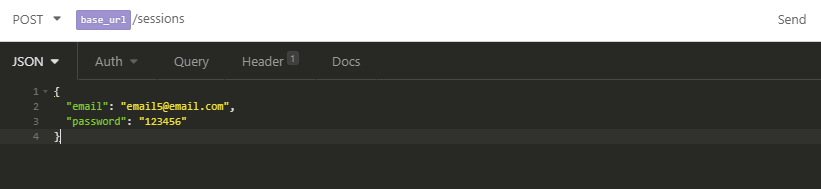
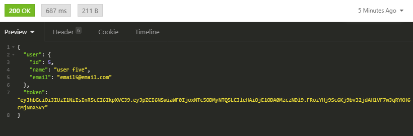

## Indice

  * [00 Iniciando o backend do gobarber](#00-iniciando-o-backend-do-gobarber)
    * [00 Configurando estrutura](#00-configurando-a-estrutura)
    * [01 Nodemon & Sucrase](#01-nodemon--sucrase)
    * [02 Conceitos do Docker](#02-conceitos-do-docker)
    * [03 Configurando o Docker](#03-configurando-o-docker)
    * [04 Sequelize & MVC](#04-sequelize-&-MVC)
    * [05 ESLint, Prettier & EditorConfig](#05-eslint-prettier--EditorConfig)
    * [06 Configurando Sequelize](#06-configurando-sequelize)
    * [07 Migration de usuario](#07-migration-de-usuario)
    * [08 Model de usuario](#08-model-de-usuario)
    * [09 Criando loader de models](#09-criando-loader-de-models)
    * [10 Cadastro de usuarios](#10-cadastro-de-usuarios)
    * [11 Gerando hash da senha](#11-gerando-hash-da-senha)
    * [12 Conceitos de JWT](#12-conceitos-de-jwt)
    * [13 Autenticacao JWT](#13-autenticacao-jwt)
    * [14 Middleware de autenticacao](#14-middleware-de-autenticacao)
    * [15 Update do usuario](#15-update-do-usuario)
    * [16 Validando dados de entrada](#16-validando-dados-de-entrada)

  * [01 Continuando API do GoBarber](#01-continuando-api-do-gobarber)
    * [Envio de arquivos](#envio-de-arquivos)
      * [Configurando Multer](#00-configurando-multer)
      * [Avatar do usuario](#01-avatar-do-usuario)
    * [Funcionalidade de agendamentos](#funcionalidade-de-agendamentos)
    * [Envio de notificacoes](#envio-de-notificacoes)
    * [Cancelamento e envio de email](#cancelamento-e-envio-de-email)
    * [Configuracoes avancadas](#configuracoes-avancadas)


# 00 Iniciando back end do gobarber
[Voltar para índice](#indice)

## 00 Configurando estrutura
[Voltar para índice](#indice)

  Objetivo: estruturar pastas e arquivos basicos da aplicacao.

  * (terminal) inicializa projeto: `yarn init -y` ;
  * (terminal) instala express: `yarn add express` ;
  * cria estrutura:

    src/
      app.js
      server.js
      routes.js

  * define arquivo **app.js**;
  * define arquivo **server.js**;
    * estrutura da aplicacao (app.js) separado do servidor e das rotas para facilitar trabalho com testes unitarios e de integracao que trabalha diretamente com a classe App;
  * define arquivo **routes.js** ;
  * (terminal) testa projeto: `node src/server.js` ;

## 01 Nodemon & Sucrase
[Voltar para índice](#indice)

  Objetivo: utilizar sintaxe de 'import' e 'export'com *sucrase*, automatizar acionamento do servidor com *nodemon* e adapta debugger para rodar com sucrase;

  * (terminal) instala sucrase e nodemon como dependencia de desenvolvimento: `yarn add sucrase nodemon -D`;
  * altera sintaxe de import e export nos arquivos:

    Imports:
    * de: const foo = require('Foo');
    * para: import foo from 'Foo';

    Exports:
    * de: module.exports = new Foo();
    * para: export default new Foo();

  * cria script personalizado 'dev' em **package.json** para rodar nodemon:

  ```
      "scripts": {
      "dev": "nodemon src/server.js"
    },
  ```

  * cria arquivo **nodemon.json** para que nodemon utilize sucrase-node ao inves de node:

  ```
  {
    "execMap: {
      "js": "node -r sucrase/register"
    }
  }
  ```
    ... para todo arquivo '.js' rode node mas antes, registre (-r) sucrase/register;

  * adiciona script em **package.json** para que debugger rode com *sucrase*:

    ```
    "scripts": {
      "dev": "nodemon src/server.js",
      "dev:debug":"nodemon --inspect src/server.js"
    },

    ```

  * cria nova configuracao na aba do bug do VSCode:

    aba bug > add configuration... > node.js e altera **launch.json**:

    de: "request": "launch"
    para: "request": "attach"

    deleta: "program": "${workspaceFolder}/index.js"
    cria: "protocol": "inspector"

    cria: "restart": true,

    cria: "skipFiles": [
            "<node_internals>/**",
            "${workspaceRoot}/node_modules/**/*.js"
          ],

  * testa debugger com: `yarn dev:debug`
  * ATENCAO: mantenha pasta *.vscode* para manter configuracoes do debugger com *sucrase*

## 02 Conceitos do Docker
[Voltar para índice](#indice)

  * Como funciona?

    * Funciona como um ambiente isolado na maquina (container);

    * Containers expoem portas para comunicacao. Ex.:

      App
        > :5432 (PostgreSQL)
        > :2707 (MongoDB)

  * Principais conceitos

    * Imagem: servico disponivel do docker. Tecnologias e ferramentas que podemos colocar em containers;

    * Container: instancia de uma imagem. Ex.: se imagem for PostGreSQL, podemos ter tres containers rodando esta imagem;

    * Docker Registry (Docker Hub): analogo ao npm do node, que contem os registros das dependencias em nuvem. O registro do docker é o docker register. Podemos até cadastrar nossas próprias imagens lá.

    * Dockerfile:

      * Receita de uma imagem: define como nossa aplicacao pode rodar em um ambiente a partir do zero. Ex.:


        ```
        # Partimos de uma imagem existente
        FROM node:10

        # Definimos a pasta e copiamos os arquivos
        WORKDIR /usr/app
        COPY . ./

        # Instalamos as depencias
        RUN yarn

        # Qual porta queremos expor?
        EXPOSE 3333

        # Executamos nossa aplicacao
        CMD yarn start

        ```

## 03 Configurando o Docker
[Voltar para índice](#indice)

  * Instala Docker CE

    * Navega para: https://docs.docker.com/install/
    * Seleciona sistema operacional e segue etapas. Em caso de windows: https://docs.docker.com/docker-for-windows/install/
    * Confere requisitos do sistema;
    * Faz download do Docker Desktop for Windows e faz instalacao;
    * (terminal) confere se foi instalado: `docker -v` ;
    * (terminal) lista todos os comandos: `docker help` ;

  * Cria servico de banco de dados PostGreSQL

    * Busca por 'docker postgres' no google;
    * Acessa: https://hub.docker.com/_/postgres;
    * Cria servico passando:
      * Nome do container: --name database
      * Password do container: -e POSTGRES_PASSWORD=docker
      * Redirecionamento de porta da porta da maquina para a porta do container: -p 5432:5432
      * (terminal) Comando: `docker run --name database -e POSTGRES_PASSWORD=docker -p 5432:5432 -d postgres`

      Obs: username padrao (postgres) nao precisa ser passado como parametro;

  * (terminal) Verifica se container esta rodando: `docker ps` ;

  * Instala PostBird (interface visual GUI para visualizar dados no banco de dados): https://electronjs.org/apps/postbird

  * Faz conexao com banco de dados utilizando PostHBird:

    * Host: localhost
    * Port: 5432
    * Username: postgres (default username)
    * Password: docker

    * Clica em 'Test Connection'
    * Clica em 'Save & Connect'

  * Cria nova database clicando em 'select database' > 'create database'

  * Renomeia database;

  * (terminal) Interrompe conexao com container: `docker stop database` ;

  * (terminal) Visualiza todos os containers que tem na maquina: `docker ps -a` ;

  * (terminal) Inicia conexao com container: `docker start database` ;

  * (terminal) Confere se container esta rodando: `docker ps` ;

  * (terminal) Visualiza log de erros do container: `docker logs database`

## 04 Sequelize & MVC
[Voltar para índice](#indice)

  * O que é Sequelize?

    * ORM para node.js para bancos de dados relacionais (sql);
    * Mesma sintaxe funciona para mySQL, PostGreSQL, SQLite;
    * Serve como tradutor de JS para query language;

  * O que é um ORM?

    * ORM: Object-relational mapping;
    * Uma forma de abstracao de banco de dados;
      * Muda forma com que nossa aplicacao se comunica com o banco de dados;

    * Considerando arquitetura MVC:
      * Tabelas viram models. Ex.:

      table users -> User.js
      table companies -> Company.js
      table projects -> Project.js

  * Manipulacao de dados

    * Nao usa INSERT nem UPDATE nem DELETE para manipulacao de dados, mas sim codigo JS.
    * Sequelize traduz JS para SQL no dialeto especificado no arquivo de configuracao. Ex:

    De:
    ```javascript
    User.create({
      name: 'Joao da Silva',
      email: 'joao@email.com.br',
    })
    ```

    Para:
    ```sql
    INSERT INTO users(name,email)
      VALUES (
        "Joao Silva",
        "joao@email.com.br"
      )
    ```

    Outro exemplo:

    De:
    ```javascript
    User.findOne({
      where: {
        email: 'joao@email.com.br'
      }
    })
    ```

    Para:
    ```sql
    SELECT *
    FROM users
    WHERE email = 'joao@email.com.br'
    LIMIT 1
    ```


  * Migrations

    * Controle de versao para base de dados;
    * Cada arquivo de migration contem instrucoes para criacao, alteracao ou remocao de tabelas ou colunas;
    * Mantem a base atualizada entre todos desenvolvedores do time e tambem no ambiente de producao;
    * Cada arquivo é uma migration e sua ordenação ocorre por data;

    Exemplo:

    ```javascript
    module.exports = {
      up:(queryInterface,Sequelize)=>{

        // Instrucao para criar nova tabela
        return queryInterface.createTable('users',{

          // Criacao de 3 campos com suas propriedades.
          // O ID é a chave primária e auto incremental.
          id:{
            allowNull: false,
            autoIncrement: true,
            primaryKey: true,
            type: Sequelize.INTEGER
          },
          name:{
            allowNull: false,
            type: Sequelize.STRING
          },
          email:{
            allowNull:false,
            unique: true,
            type: Sequelize.STRING
          }
        })
      },

      down: (queryInterface,Sequelize)=>{

        // Instrução para deletar a tabela caso haja um rollback
        return queryInterface.dropTable('users')
      }
    }
    ```

    * É possível desfazer uma migração se errarmos algo enquanto estivermos desenvolvendo a feature;

    * Depois que a migration foi enviada para outros desenvolvedores ou para ambiente de produção ela JAMAIS poderá ser alterada. Uma nova migration deverá ser criada se for necessário mudar ou criar campo, tabela ou coluna.

    * Cada migration deve realizar alterações em APENAS UMA tabela. Você pode criar várias migrations para alterações maiores;

  * Seeds

    * Popula base de dados para desenvolvimento;
    * Muito utilizado para popular dados para testes;
    * Executável apenas por código;
    * Jamais será utilizado em produção;
    * Caso sejam dados que precisam ir para produção, a própria migration pode manipular dados das tabela;

  * Arquitetura MVC

    * Forma de estruturar pastas e arquivos na aplicação para separar as responsabilidades de cada tipo de arquivo;

    * **Model**: armazena a abstração do banco, utilizado para manipular os dados contidos nas tabelas do banco. Não possuem responsabilidade sobre a regra de negócio da nossa aplicação;

    * **View**: A view é o retorno ao cliente. Em aplicações que não utilizam o modelo de API REST isso pode ser um HTML, mas no nosso caso a view é apenas nosso JSON que será retornado ao front-end e depois manipulado pelo ReactJS ou React Native.

    * **Controller**: O controller é o ponto de entrada das requisições da nossa aplicação. Uma rota geralmente está associada diretamente com um método do controller. Podemos incluir a grande parte das *regras de negócio* da aplicação nos controllers (conforme a aplicação cresce podemos isolar as regras).

  * A face de um controller

    * São classes;
    * Sempre retorna um JSON;
    * Deve funcionar sozinho. Cada método controller não pode chamar outro método de outro controller nem dele mesmo.
    * Quando criar um novo controller:
      * Quando tivermos uma nova entidade na aplicação;
      * Deve conter apenas 5 métodos;

      Exemplo:

      ```javascript
      class UserController{
        index(){}   // Listagem de usuarios
        show(){}    // Exibir um unico usuario
        store(){}   //  Cadastrar usuario
        update(){}  // Alterar usuario
        delete(){}  // Remover usuario
      }
      ```

## 05 ESLint, Prettier & EditorConfig
[Voltar para índice](#indice)

  Objetivo: configurar ferramentas que irão ajudar a padronizar o código (manter padrão de escrita de código entre todos os desenvolvedores);

  * Usar padrão Airbnb;
  * (terminal) instalar eslint copmo dependencia de desenvolvimento: `yarn add eslint -D` ;
  * (terminal) inicializar eslint: `yarn eslint --init` ;
  * Configura eslint:

    * How would you like to use ESLint?
      * To check syntax, find problems, and enforce code style;

    * What type of modules does your project use?
      * JavaScript modules (import/export);

    * Which framework does your project use?
      * None;

    * Does your project use TypeScript?
      * No;

    * Where does your code run?
      * Node;

    * How would you like to define a style for your project?
      * Use a popular style guide;

    * Which style guide do you want to follow?
      * Airbnb;

    * What format do you want your config file to be in?
      * JavaScript;

    * Would you like to install them now with npm?
      * Y;

    Obs.: eslint faz instalacao das dependencias utilizando 'npm' ao inves de 'yarn'. Entao ele cria um arquivo **package-lock.json**;

  * Deleta arquivo **package-lock.json**;
  * (terminal) Mapeia novas dependencias no **yarn.lock**: `yarn` ;
  * (extensao VS Code) Instala extensão **ESLint** no VSCode;
  * Abre configurações do VSCode em formato de JSON: Ctrl + Shift + p > open settings (JSON);
  * Insere atributo para forçar autofix:

    ```javascript
    // Aplica autofix do ESLint
    "editor.codeActionsOnSave": {"source.fixAll.eslint": true},
    "eslint.validate": ["javascript", "javascriptreact","typescriptreact"],
    ```

  * Altera end of line sequence para: LF
  * Sobrescreve regras do eslint no arquivo **.eslintrc.js**:

    ```javascript
    rules: {

          // torna desecessario usar 'this' nos metodos da classe
      "class-method-use-this": "off",

      // permite receber parametro e fazer alteracoes nesse parametro (usado pelo sequelize)
      "no-param-reassign":"off",

      // desabilita obrigatoriedade do camelcase notation (necessario para as conexoes do database)
      "camelcase":"off",

      // gera erro para variaveis nao utilizadas com excessao da variavel next dos middlewares
      "no-unused-vars":["error",{"argsIgnorePattern":"next"}],
    },

    ```

    * (terminal) Instala dependencias do prettier: `yarn add prettier eslint-config-prettier eslint-plugin-prettier -D` ;
    * Altera propriedade 'extends' do arquivo **.eslintrc.js**:

      ```javascript
      extends: [
        'airbnb-base',
        'prettier'
      ],
      ```

    * Cria propriedade 'plugins':

    ```javascript
    plugins: ['prettier'],
    ```

    * Cria arquivo **.prettierrc** e sobrescreve algumas regras para manter padrao Airbnb:

    ```javascript
    {
      "singleQuote": true,
      "trailingComma": "es5"
    }
    ```

    * (terminal) Fixa arquivos em src automaticamente: `yarn eslint --fix src --ext .js` ;
    * (extensao VS Code) Instala **Editor Config for VS Code** no VS Code;
    * Vai na raiz do repositorio > botao direito > **generate .editorconfig**;
    * Troca ultimas duas variaveis de 'false' para 'true':

    ```
      trim_trailing_whitespace = true
      insert_final_newline = true
    ```

## 06 Configurando Sequelize
[Voltar para índice](#indice)

  Objetivo: configurar sequelize e o inicio da estrutura de pastas da aplicação

  * Cria estrutura de pastas e arquivos:

    * src/

      * app/
        * controllers/
          * .gitkeep
        * models/
          * .gitkeep

      * config/
        * **database.js**

      * database/
        * migrations/
          * .gitkeep

  * (terminal) Instala dependencia 'sequelize': `yarn add sequelize`
  * (terminal) Instala 'sequelize-cli' como dependencia de desenvolvimento: `yarn add sequelize-cli -D`
    * sequelize-cli: interface de linha de comando para facilitar criacao de migrations, models, etc;
  * Cria arquivo **.sequelizerc**:
    * (arquivo que vai exportar caminho onde estao arquivos e pastas criados com sequelize);
    * Ex.: exporta caminhos até as pastas de config de database, pasta de migrations, pasta de models, etc;
    * Usa sintaxe do common JS e **nao utiliza sintaxe import/export**;
  * Transforma arquivo para sintaxe de JavaScript (canto inferior direito no VS Code);
  * Cria conteudo do arquivo **.sequelizerc**:

    ```javascript
    // IMPORTS
    // padroniza caminhos no windows, linux e mac
    const {resolve} = require('path');

    // EXPORTS
    // exporta objeto
    module.exports = {

      // caminho para arquivo de configuracao do database
      config: resolve(__dirname, 'src', 'config', 'database.js'),

      // caminho para pasta de models
      'models-path': resolve(__dirname,'src', 'app', 'models'),

      // caminho para pasta de migrations
      'migrations-path': resolve(__dirname,'src','database','migrations'),

      // caminho para pasta de seeds
      'seeds-path': resolve(__dirname,'src','database','seeds')

    };

    ```

    * (terminal) Adiciona dependencias 'pg' e 'pg-hstore': `yarn add pg pg-hstore` ;
      * dependencias sao necessarias para usar 'sequelize' e 'sequelize-cli' com o dialeto 'postgres' ;
      * para utilizacao com outros dialetos, [checar documentação](https://sequelize.org/master/manual/dialect-specific-things.html);

    * Cria conteudo do arquivo de configuracao do banco de dados **src/config/database.js**:
      * Arquivo tambem utiliza sintaxe do common JS;
      * Sera acessado tanto pela aplicacao quanto pelo sequelize-cli;

      ```javascript
      // EXPORTS
      // exporta objeto
      module.exports = {

        // define dados para conexao com banco de dados
        dialect: 'postgres', // informa qual sera o dialeto utilizado
        host: 'localhost', // informa o host onde se encontra a base de dados
        username: 'postgres', // informa username para acesso
        password: 'docker', // password para acesso
        database: 'lmp-platform', // nome do banco de dados criado

        // define funcinalidades extra
        define: {
          timestamps: true, // garante coluna 'created_at' e 'updated_at' em cada tabela do banco de dados
          underscored: true, // padroniza nomenclatura de tabelas
          underscoredAll: true, // padroniza nomenclatura de colunas com o padrao underscore '_'
        }
      }

      ```

## 07 Migration de usuario
[Voltar para índice](#indice)

  Objetivo: criacao da primeira migration (migration de usuario) utilizando sequelize-cli.

  * Cria migration 'create-users' usando sequelize-cli: `yarn sequelize migration:create --name=create-users` ;
  * Atualiza arquivo de migration criado:

    ```js
    module.exports = {
      up: (queryInterface, Sequelize) => {
        return queryInterface.createTable('users', {
          id: {
            type: Sequelize.INTEGER,
            allowNull: false,
            autoIncrement: true,
            primaryKey: true,
          },
          name: {
            type: Sequelize.STRING,
            allowNull: false,
          },
          email: {
            type: Sequelize.STRING,
            allowNull: false,
            unique: true,
          },
          password_hash: {
            type: Sequelize.STRING,
            allowNull: false,
          },
          provider: {
            type: Sequelize.BOOLEAN,
            default: false,
            allowNull: false,
          },
          created_at: {
            type: Sequelize.DATE,
            allowNull: false,
          },
          updated_at: {
            type: Sequelize.DATE,
            allowNull: false,
          },
        });
      },

      down: queryInterface => {
        return queryInterface.dropTable('users');
      },
    };

    ```

  * Roda primeira migration: `yarn sequelize db:migrate` ;
  * Utilizando o PostBird confira se tabela de usuarios foi criada no banco de dados;
  * Para desfazer a migration antes de ter enviado a outros desenvolvedores:
    * Desfazer a ultima migration: `yarn sequelize db:migrate:undo` ;
    * Desfazer todas as migrations: `yarn sequelize db:migration:undo:all` ;

## 08 Model de usuario
[Voltar para índice](#indice)

  Objetivo: criar model de usuarios que sera utilizado para criar, deletar e alterar dados de usuarios.

  * Cria arquivo **src/app/models/User.js** e insere conteúdo:

    ```javascript
    /* --------------------------------- IMPORTS ---------------------------------*/
    import Sequelize, { Model } from 'sequelize';

    /* --------------------------------- CONTENT ---------------------------------*/
    /*
    ** Cria classe User extendendo os metodos da classe Model, da dependencia
    ** 'sequelize'
    */
    class User extends Model {
      /*
      ** Metodo estatico que sera chamado automaticamente pelo sequelize
      */
      static init(sequelize) {
        /*
        ** Chama metodo init da classe superior (Model) enviando colunas da base de dados
        ** Envia somente o que o usuario vai fornecer como input (chave primaria, etc, nao sao necessarias)
        */
        super.init(
          {
            name: Sequelize.STRING,
            email: Sequelize.STRING,
            password_hash: Sequelize.STRING,
            provider: Sequelize.BOOLEAN,
          },
          {
            sequelize,
          }
        );
      }
    }

    /* --------------------------------- EXPORTS ---------------------------------*/
    export default User();

    ```

    * Se quiser visualizar outras opcoes de dados que podem ser passados no metodo init digite: Ctrl + space

## 09 Criando loader de models
[Voltar para índice](#indice)

  Objetivo: criar arquivo que faz conexao com banco de dados definido em **src/config/database.js** e carrega todos os models da aplicacao para toda a aplicacao conheca os models.

  * Cria arquivo **src/database/index.js** que realiza a conexao com banco de dados e carrega models:

  ```js
  /* --------------------------------- IMPORTS ---------------------------------*/
  import Sequelize from 'sequelize';
  import databaseConfig from '../config/database';
  import User from '../app/models/User';

  /* --------------------------------- CONTENT ---------------------------------*/

  /* Cria array com todos os models da aplicacao */
  const models = [User];

  /*
  ** Cria classe Database
  */
  class Database {
    constructor() {
      this.init();
    }

    /*
    ** metodo que faz conexao com base de dados e carrega os models da aplicacao
    */
    init() {
      /*
      ** Variavel esperada dentro dos models no metodo init
      */
      this.connection = new Sequelize(databaseConfig);

      /* Acessa o metodo init de cada model da aplicacao passando a conexao */
      models.map(model => model.init(this.connection));
    }
  }

  /* --------------------------------- EXPORTS ---------------------------------*/
  export default new Database();

  ```

  * Importa arquivo **database/index.js** em **src/app.js**:

  ```js
  /*
    ** Importa arquivo que faz conexao com banco de dados. Nao é necessario passar
    ** o caminho completo com '.../index.js', pois ele ja assimila automaticamente
    ** esse nome.
    */
  import './database';
  ```

  * Altera **routes.js** para testar cadastro de usuario respondendo res.json(user):

    ```js
    // IMPORTS  --------------------------------------------------------------------
    import { Router } from 'express';
    import User from './app/models/User';

    // CONTENT ---------------------------------------------------------------------
    const routes = new Router();

    // define rota raiz
    routes.get('/', async (req, res) => {
      /*
      ** Cria usuario teste na rota raiz para avaliar se loader de models esta funcionando
      */
      const user = await User.create({
        name: 'usuario numero um',
        email: 'user1@email.com',
        password_hash: '123456',
      });

      /* Altera res.json() para retornar objeto com usuario criado */
      return res.json(user);
    });

    // EXPORTS  ---------------------------------------------------------------------
    export default routes;
    ```

## 10 Cadastro de usuarios
[Voltar para índice](#indice)

  Objetivo: criar feature de registro de usuarios na api.

  * Cria arquivo **controllers/UserController.js**:

    ```js
    /* --------------------------------- IMPORTS ---------------------------------*/
    import User from '../models/User';

    /* --------------------------------- CONTENT ---------------------------------*/
    class UserController {
      /**
      * Metodo store com mesma face de um middleware no node.
      * Recebe dados do usuario e cria novo registro dentro da base de dados.
      */
      async store(req, res) {
        /** Verifica se usuario do corpo da requisicao ja existe */
        const userExists = await User.findOne({ where: { email: req.body.email } });

        /** Se usuario ja existir, retorna erro */
        if (userExists) {
          return res.json({ error: 'User already exists!' });
        }

        /**
        * Cria usuario na base de dados usando resposta asincrona e retorna apenas
        * dados uteis.
        */
        const { id, name, email, provider } = await User.create(req.body);

        /** Retorna json apenas com dados uteis ao frontend */
        return res.json({
          id,
          name,
          email,
          provider,
        });
      }
    }

    /* --------------------------------- EXPORTS ---------------------------------*/
    export default new UserController();

    ```

  * Modifica arquivo **routes.js**:
    * Importa UserController;
    * Deleta rota '/' get teste;
    * Cria rota '/users' tipo post chamando metodo UserController.store;

    ```js
    /* --------------------------------- IMPORTS ---------------------------------*/
    import { Router } from 'express';
    import UserController from './app/controllers/UserController';

    /* --------------------------------- CONTENT ---------------------------------*/
    const routes = new Router();

    /** Define rota post para criar novo usuario */
    routes.post('/users', UserController.store);

    /* --------------------------------- EXPORTS ---------------------------------*/
    export default routes;
    ```

  * (insomnia) Cria variavel 'base_url' em 'no environments' > 'manage enviroments' > 'base environment":

    ```js
    {
      "base_url":"http://localhost:3333"
    }
    ```
  * (insomnia) Cria novo workspace com nome da aplicacao (ex.: gostack-gobarber);
  * (insomnia) Cria pasta 'Users';
  * (insomnia) Cria requisicao 'Create'
    * Tipo: 'POST';
    * Formato: 'JSON';
    * Rota: base_url/users;
    * Corpo:

      ```js
      {
        "name": "name one",
        "email": "email1@email.com",
        "password_hash":"123456"
      }
      ```
  * (terminal) Roda servidor: `yarn dev` ;
  * (insomnia) Envia requisicao clicando em 'send';
  * (insomnia) Verifica se resposta da requisicao esta de acordo com o codigo;
    * Em caso de erro do tipo 'SequelizeUniqueConstraintError: Validation error',
      verifique se o codigo esta verificando e bloqueando fluxo da requisicao caso
      email ja esteja cadastrado;

## 11 Gerando hash da senha
[Voltar para índice](#indice)

  Objetivo: gerar o hash da senha do usuario para armazenar no banco de dados.
  Story: usuario envia senha sem hash, hash da senha é gerado e armazenado.

  * (terminal) instala dependencia bcryptjs: `yarn add bcryptjs` ;
  * Edita model de usuario (**User.js**):
    * Importa bcrypt :

      ```js
      import bcrypt from 'bcryptjs';
      ```

    * Cria novo atributo 'password' dentro do model:

      ```js
      {
        name: Sequelize.STRING,
        email: Sequelize.STRING,
        passowrd: Sequelize.VIRTUAL, // Campo sem correspondencia no database
        password_hash: Sequelize.STRING,
        provider: Sequelize.BOOLEAN,
      },
      ```

    * Adiciona hook apos `super.init()`:

      ```js
      /**
       * Hooks: Funcionalidade do sequelize -> trecho de codigo executados de
      * forma automatica baseado em acoes que acontecem no nosso model.
      *
      * Hook 'before save': executa trecho de codigo antes de objeto ser salvo
      * no banco de dados (criado ou editado).
      */
      this.addHook('beforeSave', async user => {
        /** Se houver password na requisicao */
        if (user.password) {
          /**
           * Aguarda e define password_hash como 8 rouds de criptografia da string
          * enviada.
          */
          user.password_hash = await bcrypt.hash(user.password, 8);
        }
      });

      /** Retorna model que acaba de ser inicializado */
      return this;
      ```

  * (insomnia) edita corpo da requisicao para enviar password ao inves de password_hash:

    ```js
    {
      "name": "user x",
      "email": "emailx@email.com",
      "password": "123456"
    }
    ```

  * (insomnia) envia requisicao e verifica se usuario foi criado no banco de dados;
  * (postbird) atualiza conexao e verifica se hash da senha do usuario foi armazenada;

## 12 Conceitos de JWT
[Voltar para índice](#indice)

  Objetivo: entender os conceitos de autenticação JWT.

  * JWT: JSON Web Token;
  * O que é: um método de fazer autenticação em API REST [Representational state transfer](https://en.wikipedia.org/wiki/Representational_state_transfer);

  

  * Exemplo:
    * Usuario envia 'email' e 'password' para rota '/sessions' conforme figura acima;
    * Rota faz verificacoes de que precisa, vai ao banco de dados e verifica se informacoes
      estao corretas;
    * Se informacoes estiverem corretas, rota geram token JWT;
    * Token é gerado a partir de biblioteca;
    * Token tem formato conforme imagem acima, com tres hashs separadas por '.';
      * Headers: guardam tipo de token gerado e algoritmo utilizado para gerar;
        * Quando frontend precisar obter informacoes de dentro do token, ele vai precisar
          saber qual tipo de criptografia foi utilizada.
      * Payload: contem informacoes nao sensiveis, para caso seja necessario utiliza-las
        em algum lugar.
      * Assinatura: garante que token nao foi modificado externamente por outro usuario;

## 13 Autenticacao JWT
[Voltar para índice](#indice)

  Objetivo: fazer parte de autenticacao do usuario.

  * (terminal) instala dependencia jsonwebtoken: `yarn add jsonwebtoken` ;

  * Cria session controller no arquivo **controllers/SessionController.js**:

    ```js
    /* --------------------------------- IMPORTS ---------------------------------*/
    import jwt from 'jsonwebtoken';
    import authConfig from '../../config/auth';
    import User from '../models/User';

    /* --------------------------------- CONTENT ---------------------------------*/
    class SessionController {
      async store(req, res) {
        /** Salva email e senha recebidos no corpo da requisicao */
        const { email, password } = req.body;

        /** Encontra usuario que tem campo email = variavel email (short sintax) */
        const user = await User.findOne({ where: { email } });

        /** Se usuario nao existe retorna erro 401 (nao autorizado) */
        if (!user) {
          return res.status(401).json({ error: 'User not found' });
        }

        /** Se hash da senha nao bate com hash salvo no database */
        if (!(await user.checkPassword(password))) {
          return res.status(401).json({ error: 'Password does not match' });
        }

        /** Se email foi encontrado e senha estiver correta salva 'id' e 'name' */
        const { id, name } = user;

        return res.json({
          /** Retorna dados do usuario para o cliente */
          user: { id, name, email },
          /** Retorna jwt token */
          token: jwt.sign(
            /** Envia payload */
            {
              id,
            },
            /** Envia string secreta aleatoria (ex.: gerada pelo md5online.org) */
            authConfig.secret,
            /** Envia data de expiracao obrigatoria do token (padrao: 7 dias) */
            { expiresIn: authConfig.expiresIn }
          ),
        });
      }
    }

    /* --------------------------------- EXPORTS ---------------------------------*/
    export default new SessionController();

    ```

     P: por que criar session controller se ja temos user controller?
      R: porque estamos criando uma sessao e nao um usuario. É preciso pensar na entidade que está tratando no momento. Até porque o UserController já tem o método `store()` e so podemos ter uma vez o mesmo metodo em uma classe e so podemos ter cinco metodos (index, show, store, update e delete) dentro de um controller.

  * Edita **models/User.js** para criar metodo de verificacao de senha usando 'bcryptjs':

    ```js
    /* --------------------------------- IMPORTS ---------------------------------*/
    import Sequelize, { Model } from 'sequelize';
    import bcrypt from 'bcryptjs';

    /* --------------------------------- CONTENT ---------------------------------*/
    /**
    * Cria classe User extendendo os metodos da classe Model, da dependencia
    * 'sequelize'
    */
    class User extends Model {
      /**
      * Metodo estatico que sera chamado automaticamente pelo sequelize
      */
      static init(sequelize) {
        /**
        * Chama metodo init da classe superior (Model) enviando colunas da base
        * de dados e envia somente o que o usuario vai fornecer como input.
        * (chave primaria, etc, nao sao necessarias)
        */
        super.init(
          {
            name: Sequelize.STRING,
            email: Sequelize.STRING,
            password: Sequelize.VIRTUAL, // Campo sem correspondencia no database
            password_hash: Sequelize.STRING,
            provider: Sequelize.BOOLEAN,
          },
          {
            /*
            ** Argumento que sera enviado pelo loader de models
            */
            sequelize,
          }
        );

        /**
        * Hooks: Funcionalidade do sequelize -> trecho de codigo executados de
        * forma automatica baseado em acoes que acontecem no nosso model.
        *
        * Hook 'before save': executa trecho de codigo antes de objeto ser salvo
        * no banco de dados (criado ou editado).
        */
        this.addHook('beforeSave', async user => {
          /** Se houver password na requisicao */
          if (user.password) {
            /**
            * Aguarda e define password_hash como 8 rouds de criptografia da string
            * enviada.
            */
            user.password_hash = await bcrypt.hash(user.password, 8);
          }
        });

        /** Retorna model que acaba de ser inicializado */
        return this;
      }

      /** Recebe senha enviada pelo cliente */
      checkPassword(password) {
        /**
        * Retorna comparacao entre hash da senha enviada com hash salvo no
        * banco de dados.
        *
        * Retorna 'true' caso senhas sejam iguais.
        */
        return bcrypt.compare(password, this.password_hash);
      }
    }

    /* --------------------------------- EXPORTS ---------------------------------*/
    export default User;

    ```

  * Edita **src/routes.js** criando a rota que vai acessar session controller:

    ```js
    /* --------------------------------- IMPORTS ---------------------------------*/
    import { Router } from 'express';
    import UserController from './app/controllers/UserController';
    import SessionController from './app/controllers/SessionController';

    /* --------------------------------- CONTENT ---------------------------------*/
    const routes = new Router();

    /** Define rota post para criar novo usuario */
    routes.post('/users', UserController.store);
    /** Define rota post para criar nova session */
    routes.post('/sessions', SessionController.store);

    /* --------------------------------- EXPORTS ---------------------------------*/
    export default routes;
    ```

  * Cria arquivo **config/auth.js** para separar segredo e expiracao do token em outro arquivo:

    ```js
    /* --------------------------------- EXPORTS ---------------------------------*/
    export default {
      /** String secreta aleatoria (ex.: gerada no md5online.org) */
      secret: '5ed32cb43d6810f8b9271a6858613e94',
      /** Envia data de expiracao obrigatoria do token (padrao: 7 dias) */
      expiresIn: '7d',
    };
    ```

  * (insomnia):
    * Cria pasta 'Sessions';
    * Duplica requsicao 'Create' de 'Users' e coloca na pasta 'Sessions';
    * Muda rota da requisicao 'Sessions'>'Create' para: `base_url/sessions` ;
    * Deleta atributo "name" do corpo da requisicao;
    * Clica em 'Send' para enviar requisicao e avalia retorno;

    * Request example:
    

    * Response example:
    

## 14 Middleware de autenticacao
[Voltar para índice](#indice)

  Objetivo: Bloquear acesso de usuario a alguma rota caso ele ainda nao esteja logado (autenticado). Ex.: edicao do usuario.

  * Edita **UserController.js** criando metodo asincrono de update do usuario:

    ```js
    /** Metodo de alteracao dos dados do usuario */
    async update(req, res) {
      return res.json({ ok: true });
    }
    ```

  * Cria rota de acesso tipo PUT para '/users' no **routes.js**:

    ```js
    /** Define rota PUT para editar dados do usuario */
    routes.put('/users', UserController.update);
    ```

  * (insomnia) Cria requisicao 'Users'>'Update' tipo PUT com corpo:

    ```js
    {
      "email": "testuser@email.com",
      "password": "123456"
    }
    ```

  * (insomnia) envia requisicao e confirma se esta recebendo o retorno ```{ok: true}``` ;

  Obs.: Para evitar que rota de alteracao de usuario seja acessada por usuarios que nao estejam autenticados usamos middlewares, a melhor forma de interceptar requesicoes para fazer validacoes antes de serem executadas.

  * Middleware precisa verificar se usuario esta logado;
    * Como?
      * Utilizando o token gerado durante o login em toda proxima requisicao que o usuario fizer;
    * Onde que enviamos o token?
      * Enviamos pelo header da aplicacao:

      * (insomnia):
        * Forma 1:
          * Na requisicao PUT .../users, clica na aba Header;
          * Cria new Header;
            * Nome do header: 'Authorization';
            * Valor do header: 'Bearer '+ token gerado durante login (ex.: *Bearer adsigadisfjsdlfi1139804tmnlijasdflkaj213.2oiajsdf098afas0f98asd.adsklfj08902398uawodikjlkf*);

            

        * Forma 2:
          * Na requisicao PUT .../users, clica na aba 'Auth' > 'Bearer Token';
          * No campo token, preenche o valor do token gerado durante login;

          

  * Cria pasta **app/middlewares** ;
  * Cria middleware de autenticacao **app/middlewares/auth.js**:

    ```js
    /* --------------------------------- IMPORTS ---------------------------------*/
    import jwt from 'jsonwebtoken';
    /**
    * Importa 'promisify' de 'util', biblioteca padrao que vem com node.
    * O 'promisify' pega uma funcao de callback e transforma em uma funcao onde se
    * pode utilizar o async await.
    */
    import { promisify } from 'util';
    import authConfig from '../../config/auth';

    /* --------------------------------- CONTENT ---------------------------------*/

    /* --------------------------------- EXPORTS ---------------------------------*/
    /** Exporta middleware (funcao) usando req, res e next */
    export default async (req, res, next) => {
      /** Get authorization header from requisition header */
      const authHeader = req.headers.authorization;
      /** Se header nao estiver presente na requisicao */
      if (!authHeader) {
        /** Retorna erro */
        res.status(401).json({ error: 'Token not provided' });
      }

      /**
      * Caso contrario, divide a authHeader por espacos, desestrutura, descarta
      * posicao 0 do array e pega apenas token (posicao 1 do array).
      */
      const [, token] = authHeader.split(' ');

      /** Define try catch pois requisicao pode retornar erro */
      try {
        /**
        * Decifra token utilizando metodo jwt.verify
        * Obs.: jwt.verify usa callback e por isso usamos 'promisify' para
        * transformar em funcao tipo async await */
        const decoded = await promisify(jwt.verify)(token, authConfig.secret);

        /** Inclui ID do usuario dentro do nosso req */
        req.userId = decoded.id;

        /** Se middleware nao retornar erro, requisicao chama o 'next' controller */
        return next();

        /** Caso jwt.verify retorne erro */
      } catch (err) {
        /** Informa que token nao e valido */
        return res.json({ error: 'Invalid token' });
      }
    };
    ```

  * Importa middleware de autenticacao em **routes.js** ;

    ```js
    import authMiddleware from './app/middlewares/auth';
    ```

    Obs.: o middleware de autenticacao pode ser utilizado em **routes.js** de forma local ou global (aplicado a uma rota especifica ou para varias rotas que venham apos sua declaracao);

      * Utilizacao local:

        ```js
        routes.put('/users', authMiddleware, UserController.update);
        ```

      * Utilizacao global (antes das rotas que precisam ser interceptadas pelo middleware):

        ```js
        /** Usa authMiddleware em rotas que vierem apos esta declaracao */
        routes.use(authMiddleware);
      ```

    * Arquivo **routes.js** atualizado:

      ```js
      /* --------------------------------- IMPORTS ---------------------------------*/
      import { Router } from 'express';
      import UserController from './app/controllers/UserController';
      import SessionController from './app/controllers/SessionController';
      import authMiddleware from './app/middlewares/auth';

      /* --------------------------------- CONTENT ---------------------------------*/
      const routes = new Router();

      /** Define rota PUT para criar novo usuario */
      routes.post('/users', UserController.store);
      /** Define rota POST para criar nova session */
      routes.post('/sessions', SessionController.store);

      /** Define MIDDLEWARE GLOBAL que vale para rotas que vem apos sua declaracao */
      routes.use(authMiddleware);
      /** Define rota PUT para editar dados do usuario */
      routes.put('/users', UserController.update);

      /* --------------------------------- EXPORTS ---------------------------------*/
      export default routes;
      ```

  * Atualiza metodo 'update' de **UserController.js** conferindo se esta recebendo valor de userId adicionado a requisicao pelo middleware de autenticacao criado:

    ```js
    /* --------------------------------- IMPORTS ---------------------------------*/
    import User from '../models/User';

    /* --------------------------------- CONTENT ---------------------------------*/
    class UserController {
      /**
      * Metodo store com mesma face de um middleware no node.
      * Recebe dados do usuario e cria novo registro dentro da base de dados.
      */
      async store(req, res) {
        /** Verifica se usuario do corpo da requisicao ja existe */
        const userExists = await User.findOne({ where: { email: req.body.email } });

        /** Se usuario ja existir, retorna erro */
        if (userExists) {
          return res.json({ error: 'User already exists!' });
        }

        /**
        * Cria usuario na base de dados usando resposta asincrona e retorna apenas
        * dados uteis.
        */
        const { id, name, email, provider } = await User.create(req.body);

        /** Retorna json apenas com dados uteis ao frontend */
        return res.json({
          id,
          name,
          email,
          provider,
        });
      }

      /** Metodo de alteracao dos dados do usuario */
      async update(req, res) {
        /** Pega id do usuario inserido na requisicao atravez do middleware de autenticacao */
        console.log(req.userId);

        /** Retorna json */
        return res.json({ ok: true });
      }
    }

    /* --------------------------------- EXPORTS ---------------------------------*/
    export default new UserController();
    ```

## 15 Update do usuario
[Voltar para índice](#indice)

  Objetivo: permitir que usuario altere dados cadastrais.

  * (insomnia) edita requisicao 'Users'>'Update' tipo PUT alterando corpo para:

    ```js
    {
      "name":"test user",
      "email": "testuser@email.com",
      "oldPassword":"123456",
      "password": "123456"
    }
    ```

  * Atualiza metodo `update()` do arquivo **UserController.js** adicionando leitura e verificacao de informacoes enviadas na requisicao de atualizacao do usuario:

    ```js
    /* --------------------------------- IMPORTS ---------------------------------*/
    import User from '../models/User';

    /* --------------------------------- CONTENT ---------------------------------*/
    class UserController {
      /**
      * Metodo store com mesma face de um middleware no node.
      * Recebe dados do usuario e cria novo registro dentro da base de dados.
      */
      async store(req, res) {
        /** Verifica se usuario do corpo da requisicao ja existe */
        const userExists = await User.findOne({ where: { email: req.body.email } });

        /** Se usuario ja existir, retorna erro */
        if (userExists) {
          return res.status(400).json({ error: 'User already exists!' });
        }

        /**
        * Cria usuario na base de dados usando resposta asincrona e retorna apenas
        * dados uteis.
        */
        const { id, name, email, provider } = await User.create(req.body);

        /** Retorna json apenas com dados uteis ao frontend */
        return res.json({
          id,
          name,
          email,
          provider,
        });
      }

      /** Metodo de alteracao dos dados do usuario */
      async update(req, res) {
        /** Busca email e oldPassword de dentro do req.body */
        const { email, oldPassword, password } = req.body;

        /** Get current user information */
        const user = await User.findByPk(req.userId);

        /** If user is changing the email adress */
        if (email !== user.email) {
          /** Verify if new email already exists in the database */
          const userExists = await User.findOne({
            where: { email },
          });

          /** If email is already taken return error */
          if (userExists) {
            return res.status(400).json({ error: 'User already exists!' });
          }
        }

        /** If user has informed new password without informing old password */
        if (password && !oldPassword) {
          /** ...return arror 401 and request user to inform old password */
          res.status(401).json({ error: 'Inform old password' });
        }

        /**
        * If user has informed old password and (&&) it does not match with its old
        * password...
        */
        if (oldPassword && !(await user.checkPassword(oldPassword))) {
          /**
          *  ...return error 401
          */
          res.status(401).json({ error: 'Password does not match' });
        }

        /** If all requirements were met then updates user informaiton */
        const { id, name, provider } = await user.update(req.body);

        /** Retorna json apenas com dados uteis ao frontend */
        return res.json({
          id,
          name,
          email,
          provider,
        });
      }
    }

    /* --------------------------------- EXPORTS ---------------------------------*/
    export default new UserController();
    ```

## 16 Validando dados de entrada
[Voltar para índice](#indice)

  Objetivo: validar dados de entrada no backend. Geralmente se faz a validacao tanto no backend quanto no frontend. Existem varias bibliotecas e formas de se fazer a validacao. Utilizaremos a biblioteca *Yup* para isso. *Yup* é uma biblioteca de schema validation que é uma forma simples de definir os campos que devem estar presentes dentro do corpo da requisicao no formato JSON e qual seu tipo (ex.: é uma string, obrigatoria, minimo 6 digitos, etc..).

  * (terminal) instala *Yup*: `yarn add yup` ;
  * Edita arquivo **UserController.js** adicionando *Yup* para schema validation nos metodos *store()* e *update()*:

    ```js
    /* --------------------------------- IMPORTS ---------------------------------*/
    /** Importa tudo de yup como Yup (dependencia nao tem export default) */
    import * as Yup from 'yup';
    import User from '../models/User';

    /* --------------------------------- CONTENT ---------------------------------*/
    class UserController {
      /**
      * Metodo store com mesma face de um middleware no node.
      * Recebe dados do usuario e cria novo registro dentro da base de dados.
      */
      async store(req, res) {
        /** Define schema to validate req.body prior to 'store()' data */
        const schema = Yup.object().shape({
          /** Attribute 'name' is a required string */
          name: Yup.string().required(),
          /** Attribute 'email' is a required string with email format */
          email: Yup.string()
            .email()
            .required(),
          /** Attribute 'password' is a required string with at least 6 digits */
          password: Yup.string()
            .required()
            .min(6),
        });

        /** If 'req.body' do not attend to the schema requirements (is not valid) */
        if (!(await schema.isValid(req.body))) {
          /** Return error status 400 with message 'Validation has failed' */
          return res.status(400).json({ error: 'Validation has failed' });
        }

        /** Verifica se usuario do corpo da requisicao ja existe */
        const userExists = await User.findOne({ where: { email: req.body.email } });

        /** Se usuario ja existir, retorna erro */
        if (userExists) {
          return res.status(400).json({ error: 'User already exists!' });
        }

        /**
        * Cria usuario na base de dados usando resposta asincrona e retorna apenas
        * dados uteis.
        */
        const { id, name, email, provider } = await User.create(req.body);

        /** Retorna json apenas com dados uteis ao frontend */
        return res.json({
          id,
          name,
          email,
          provider,
        });
      }

      /** Metodo de alteracao dos dados do usuario */
      async update(req, res) {
        /** Define schema to validate req.body prior to 'update()' method */
        const schema = Yup.object().shape({
          /** Attribute 'name' is a string */
          name: Yup.string(),
          /** Attribute 'email' is a string with email format */
          email: Yup.string().email(),
          /** Attribute 'password' is a string with at least 6 digits */
          password: Yup.string().min(6),
          /** Attribute 'oldPassword' is a string with at least 6 digits */
          oldPassword: Yup.string()
            .min(6)
            /**
            * ... and when password is sent, this field (oldPassword) is required.
            * In the video the instructor does the opposite (when oldPassword is
            * sent, 'password' is required) but it result in a bug (user can change)
            * its password without informing the oldPassword. So I decided to do it
            * differently here. */
            .when('password', (password, field) =>
              password ? field.required() : field
            ),
          /** Attribute 'checkPassword' is a string */
          confirmPassword: Yup.string()
            /**
            * ... and when password is present, this field (confirmPassword) must
            * be equal to 'password'
            */
            .when('password', (password, field) =>
              password ? field.required().oneOf([Yup.ref('password')]) : field
            ),
        });

        /** If 'req.body' do not attend to the schema requirements (is not valid) */
        if (!(await schema.isValid(req.body))) {
          /** Return error status 400 with message 'Validation has failed' */
          return res.status(400).json({ error: 'Validation has failed' });
        }

        /** Busca email e oldPassword de dentro do req.body */
        const { email, oldPassword } = req.body;

        /** Get current user information */
        const user = await User.findByPk(req.userId);

        /** If user is changing the email adress */
        if (email !== user.email) {
          /** Verify if new email already exists in the database */
          const userExists = await User.findOne({
            where: { email },
          });

          /** If email is already taken return error */
          if (userExists) {
            return res.status(400).json({ error: 'User already exists!' });
          }
        }

        /**
        * If user has informed old password and (&&) it does not match with its old
        * password...
        */
        if (oldPassword && !(await user.checkPassword(oldPassword))) {
          /**
          *  ...return error 401
          */
          res.status(401).json({ error: 'Password does not match' });
        }

        /** If all requirements were met then updates user informaiton */
        const { id, name, provider } = await user.update(req.body);

        /** Retorna json apenas com dados uteis ao frontend */
        return res.json({
          id,
          name,
          email,
          provider,
        });
      }
    }

    /* --------------------------------- EXPORTS ---------------------------------*/
    export default new UserController();

    ```

  * Edita arquivo **SessionController.js** adicionando *Yup* para schema validation no metodo *store()*:

    ```js
    /* --------------------------------- IMPORTS ---------------------------------*/
    import jwt from 'jsonwebtoken';
    /** Importa tudo de yup como Yup (dependencia nao tem export default) */
    import * as Yup from 'yup';
    import authConfig from '../../config/auth';
    import User from '../models/User';

    /* --------------------------------- CONTENT ---------------------------------*/
    class SessionController {
      async store(req, res) {
        /** Define schema to validate req.body prior to 'store()' data */
        const schema = Yup.object().shape({
          /** Attribute 'email' is a required string with email format */
          email: Yup.string()
            .email()
            .required(),
          /** Attribute 'password' is a required string */
          password: Yup.string().required(),
        });

        /** If 'req.body' do not attend to the schema requirements (is not valid) */
        if (!(await schema.isValid(req.body))) {
          /** Return error status 400 with message 'Validation has failed' */
          return res.status(400).json({ error: 'Validation has failed' });
        }
        /** Salva email e senha recebidos no corpo da requisicao */
        const { email, password } = req.body;

        /** Encontra usuario que tem campo email = variavel email (short sintax) */
        const user = await User.findOne({ where: { email } });

        /** Se usuario nao existe retorna erro 401 (nao autorizado) */
        if (!user) {
          return res.status(401).json({ error: 'User not found' });
        }

        /** Se hash da senha nao bate com hash salvo no database */
        if (!(await user.checkPassword(password))) {
          return res.status(401).json({ error: 'Password does not match' });
        }

        /** Se email foi encontrado e senha estiver correta salva 'id' e 'name' */
        const { id, name } = user;

        return res.json({
          /** Retorna dados do usuario para o cliente */
          user: { id, name, email },
          /** Retorna jwt token */
          token: jwt.sign(
            /** Envia payload */
            {
              id,
            },
            /** Envia string secreta aleatoria (ex.: gerada pelo md5online.org) */
            authConfig.secret,
            /** Envia data de expiracao obrigatoria do token (padrao: 7 dias) */
            { expiresIn: authConfig.expiresIn }
          ),
        });
      }
    }

    /* --------------------------------- EXPORTS ---------------------------------*/
    export default new SessionController();
    ```

  * Testa diferentes condicoes de validacao de sessao e de edicao de usuario:
    * Sessao:
      * Requisicao sem senha;
      * Requisicao sem email;
      * Requisicao com email e senha que nao combinam;
      * Requisicao com email sem formato de email;
      * [...];
    * Edicao:
      * Requisicao com 'password' e sem 'oldPassword';
      * Requisicao com 'password' e 'confirmPassword' diferentes;
      * [...];

# 01 Continuando API do GoBarber
[Voltar para índice](#indice)

## Envio de arquivos
[Voltar para índice](#indice)

### 00 Configurando Multer
[Voltar para índice](#indice)
[Video](https://skylab.rocketseat.com.br/node/continuando-api-do-go-barber/group/envio-de-arquivos/lesson/configurando-multer-2)

  Objtivo: criar funcionalidade de upload da aplicacao para que usuario que for prestador de servico tenha um avatar dentro da aplicacao (foto).

    Obs: Existem varias formas de tratar upload de arquivos dentro da aplicação.
      * Forma 1: enviar enviar imagem junto com outros dados durante o cadastro do usuário em uma única requisição;
      * Forma 2: upload de arquivos, isolado do restante. Imagem enviada ao servidor para um banco de dados e servidor retorna um ID da imagem. Quando preenchemos o restante do cadastro, enviamos apenas o ID em uma segunda requisicao. Assim mantemos a estrutura de JSON para enviar os dados visto que JSON não suporta envio de arquivos.

  * (terminal) Instala biblioteca 'multer' para lidar com 'multipart/form-data': `yarn add multer` ;

    Obs: Quando precisamos lidar com arquivos nas nossas requisicoes de chamadas ao servidor, precisamos enviar essas requisicoes em um formato chamado 'multipart/form-data' (único formato que suporta envio de arquivos físicos). Para lidar com esse tipo de requisição iremos lidar com a biblioteca 'Multer'.

  * Cria pasta 'tmp' na raiz do projeto, fora da pasta 'src';
  * Cria pasta 'uploads' dentro da pasta 'tmp';
  * Cria arquivo **src/config/multer.js** (configuracao da funcao de upload de arquivos):

    ```js
    /* --------------------------------- IMPORTS ---------------------------------*/
    import multer from 'multer';
    import crypto from 'crypto';
    import { extname, resolve } from 'path';

    /* --------------------------------- CONTENT ---------------------------------*/
    /* --------------------------------- EXPORTS ---------------------------------*/
    export default {
      /**
      * Como multer vai guardar nossos arquivos de imagem.
      * Obs.: existem varias formas de armazenar, como em CDNs (Content Delivery
      * Networks) tipo a Amazon s3 e digital ocean spaces). No nosso caso iremos
      * guardar as imagens dentro dos arquivos da aplicacao, na pasta 'tmp' usando
      * o multer.diskStorage ;
      */
      storage: multer.diskStorage({
        /** Destino do arquivo que esta sendo enviado para a aplicacao */
        destination: resolve(__dirname, '..', '..', 'tmp', 'uploads'),

        /**
        * Controle da formatacao do nome do arquivo enviado pelo usuario.
        * Evita que usuarios enviem caracteres estranhos ou com nomes de arquivos duplicados.
        */
        filename: (req, file, cb) => {
          /** Configura numero de bytes aleatorios */
          crypto.randomBytes(16, (err, res) => {
            /** Se houber erro, retorna callback com erro */
            if (err) return cb(err);

            /**
            * Se nao houver erro, envia primeiro argumento como nulo e retorna
            * string com random bytes concatenada com a extensao do arquivo;
            */
            return cb(null, res.toString('hex') + extname(file.originalname));
          });
        },
      }),
    };

    ```

  * Edita arquivo de rotas inserindo multer, multerConfig e outros:

    ```js
    /* --------------------------------- IMPORTS ---------------------------------*/
    import { Router } from 'express';
    import multer from 'multer';
    import multerConfig from './config/multer';
    import UserController from './app/controllers/UserController';
    import SessionController from './app/controllers/SessionController';
    import authMiddleware from './app/middlewares/auth';

    /* --------------------------------- CONTENT ---------------------------------*/
    /** Instancia novo roteador Router do express */
    const routes = new Router();
    /** Variavel de configuracao do upload usando multer */
    const upload = multer(multerConfig);

    /** Define rota PUT para criar novo usuario */
    routes.post('/users', UserController.store);
    /** Define rota POST para criar nova session */
    routes.post('/sessions', SessionController.store);

    /** Define MIDDLEWARE GLOBAL que vale para rotas que vem apos sua declaracao */
    routes.use(authMiddleware);
    /** Define rota PUT para editar dados do usuario */
    routes.put('/users', UserController.update);
    /**
    * Define rota POST para upload de arquivos (com middleware e controller local, sem arquivo separado)
    * Middleware chama variavel upload, metodo 'single' para fazer upload de um arquivo por vez */
    routes.post('/files', upload.single('file'), (req, res) => {
      return res.json({ ok: true });
    });

    /* --------------------------------- EXPORTS ---------------------------------*/
    export default routes;

    ```

  * (insomnia):
    * Cria pasta 'Files';
    * Cria nova requisicao 'Create', tipo 'POST' para 'base_url/files';
    * Altera 'Body' para 'Multipart Form';
      * Substitui 'new name' por 'file' (o mesmo valor definido em *upload.single* em **routes.js**);
      * Substitui 'value' pela opcao 'file';
    * Seleciona arquivo que deseja enviar;
    * Em 'environment' cria nova variavel token e salva token:
      Ex.:

        ```js
        {
          "base_url":"http://localhost:3333",
          "token":"blablabla.blablabla.blablabla"
        }
        ```
    * Em 'Auth' seleciona a opcao 'Bearer' e adiciona o token enviado durante login do usuario (salvo na variavel do base environment);
      * Opcao de envio de arquivo estara disponivel apenas na rota de edicao quando usuario for
        editar seu perfil, quando for prestador de servico, na versao web da aplicacao;

  * (terminal) roda servidor: `yarn dev` ;

  * (insomnia) envia requisicao para rota base_url/files e verifica:
    * Se recebeu {ok: true} na resposta;
    * Se arquivo foi salvo na pasta tmp/uploads;

### 01 Avatar do usuario
[Voltar para índice](#indice)
[Video](https://skylab.rocketseat.com.br/node/continuando-api-do-go-barber/group/envio-de-arquivos/lesson/avatar-do-usuario-1)

  Objetivo: salvar informações do arquivo dentro da base de dados.

  Obs.: quando multer está agindo dentro de uma rota, ele libera uma variável dentro do req (req.file, para upload de um único arquivo e req.files para upload de vários arquivos).

  Se rota POST /files retornar req.file:

    ```js
    routes.post('/files', upload.single('file'), (req, res) => {
      return res.json(req.file);
    });
    ```

  O servidor retornará todos os dados do arquivo no res.json:

    ```js
    {
      "fieldname": "file",
      "originalname": "file-01.PNG", // Nome do arquivo na maquina do cliente
      "encoding": "7bit",
      "mimetype": "image/png",
      "destination": "C:\\Users\\Avell\\Dev\\google\\github\\gostack-gobarber\\tmp\\uploads",
      "filename": "02ecf493c52d78f729aee9e39132fa76.PNG", // nome do arquivo na aplicacao
      "path": "C:\\Users\\Avell\\Dev\\google\\github\\gostack-gobarber\\tmp\\uploads\\02ecf493c52d78f729aee9e39132fa76.PNG",
      "size": 253
    }
    ```

  O que importa para nós são duas variáveis: `originalname` e `filename`. Para resgatar esses valores e guardar no banco de dados executaremos os procedimentos a seguir:

  * (terminal) Cria nova tabela de 'Files' no banco de dados: `yarn sequelize migration:create  --name=create-files` ;

  * Edita arquivo de migration criado '...-create-files.js':

    ```js
    /* --------------------------------- EXPORTS ---------------------------------*/
    module.exports = {
      up: (queryInterface, Sequelize) => {
        return queryInterface.createTable('files', {
          id: {
            type: Sequelize.INTEGER,
            allowNull: false,
            autoIncrement: true,
            primaryKey: true,
          },
          name: {
            type: Sequelize.STRING,
            allowNull: false,
          },
          path: {
            type: Sequelize.STRING,
            allowNull: false,
            unique: true,
          },
          created_at: {
            type: Sequelize.DATE,
            allowNull: false,
          },
          updated_at: {
            type: Sequelize.DATE,
            allowNull: false,
          },
        });
      },

      down: queryInterface => {
        return queryInterface.dropTable('files');
      },
    };
    ```

  * Faz migração do banco de dados para criar tabela 'Files': `yarn sequelize db:migrate` ;

  * Cria model **app/models/File.js**:

    ```js
    /* --------------------------------- IMPORTS ---------------------------------*/
    import Sequelize, { Model } from 'sequelize';

    /* --------------------------------- CONTENT ---------------------------------*/
    /**
    * Cria classe File extendendo os metodos da classe Model, da dependencia
    * 'sequelize'
    */
    class File extends Model {
      /**
      * Metodo estatico que sera chamado automaticamente pelo sequelize
      */
      static init(sequelize) {
        /**
        * Chama metodo init da classe superior (Model) enviando colunas da base
        * de dados e envia somente o que o usuario vai fornecer como input.
        * (chave primaria, etc, nao sao necessarias)
        */
        super.init(
          {
            name: Sequelize.STRING,
            path: Sequelize.STRING,
          },
          {
            /*
            ** Argumento que sera enviado pelo loader de models
            */
            sequelize,
          }
        );

        /** Retorna model que acaba de ser inicializado */
        return this;
      }
    }

    /* --------------------------------- EXPORTS ---------------------------------*/
    export default File;
    ```

  * Importa 'File' para dentro de **database/index.js** e adiciona no array de models:

    ```js
    /* --------------------------------- IMPORTS ---------------------------------*/
    import Sequelize from 'sequelize';
    import databaseConfig from '../config/database';
    import User from '../app/models/User';
    import File from '../app/models/File';

    /* --------------------------------- CONTENT ---------------------------------*/

    /* Cria array com todos os models da aplicacao */
    const models = [User, File];

    /*
    ** Cria classe Database
    */
    class Database {
      constructor() {
        this.init();
      }

      /*
      ** metodo que faz conexao com base de dados e carrega os models da aplicacao
      */
      init() {
        /*
        ** Variavel esperada dentro dos models no metodo init
        */
        this.connection = new Sequelize(databaseConfig);

        /* Acessa o metodo init de cada model da aplicacao passando a conexao */
        models.map(model => model.init(this.connection));
      }
    }

    /* --------------------------------- EXPORTS ---------------------------------*/
    export default new Database();
    ```

  * Cria arquivo **controllers/FileController.js** e move lógica do req e res (das rotas) pra dentro do **FileController.js**:

    ```js
    /* --------------------------------- IMPORTS ---------------------------------*/
    import File from '../models/File';

    /* --------------------------------- CONTENT ---------------------------------*/
    class FileController {
      async store(req, res) {
        /**
        * Desestrutura 'req.file' salvando apenas informações 'originalname' (multer)
        * como 'name' (model) e 'filename' (multer) como 'path' (model).
        */
        const { originalname: name, filename: path } = req.file;

        /**
        * Cria variável 'file' utilizando 'name' e 'path' obtidos de 'req.file'
        */
        const file = await File.create({
          name,
          path,
        });

        /** Retorna 'file' em formato JSON */
        return res.json(file);
      }
    }

    /* --------------------------------- EXPORTS ---------------------------------*/
    export default new FileController();

    ```

  * Atualiza rotas da aplicação utilizando o FileController criado:

    ```js
    /* --------------------------------- IMPORTS ---------------------------------*/
    import { Router } from 'express';
    import multer from 'multer';
    import multerConfig from './config/multer';
    import authMiddleware from './app/middlewares/auth';
    import UserController from './app/controllers/UserController';
    import SessionController from './app/controllers/SessionController';
    import FileController from './app/controllers/FileController';

    /* --------------------------------- CONTENT ---------------------------------*/
    /** Instancia novo roteador Router do express */
    const routes = new Router();
    /** Variavel de configuracao do upload usando multer */
    const upload = multer(multerConfig);

    /** Define rota PUT para criar novo usuario */
    routes.post('/users', UserController.store);
    /** Define rota POST para criar nova session */
    routes.post('/sessions', SessionController.store);

    /** Define MIDDLEWARE GLOBAL que vale para rotas que vem apos sua declaracao */
    routes.use(authMiddleware);
    /** Define rota PUT para editar dados do usuario */
    routes.put('/users', UserController.update);
    /**
    * Define rota POST para upload de arquivos (com middleware local)
    * Middleware chama variavel upload, metodo 'single' para fazer upload de
    * um arquivo por vez
    */
    routes.post('/files', upload.single('file'), FileController.store);

    /* --------------------------------- EXPORTS ---------------------------------*/
    export default routes;

    ```

  * Adiciona nova coluna na tabela de usuários para correlacionar 'user' com avatar da tabela 'files':

    * (terminal) Cria migration para adicionar coluna à tabela de usuários: `yarn sequelize migration:create --name=add-avatar-field-to-users` ;

    * Edita migration **add-avatar-filed-to-users**:

      ```js
      module.exports = {
        up: (queryInterface, Sequelize) => {
          /** Adiciona nova coluna... */
          return queryInterface.addColumn(
            /** ... à tabela 'users'... */
            'users',
            /** ... com nome 'avatar_id'... */
            'avatar_id',
            {
              /** ... de tipo INTEIRO... */
              type: Sequelize.INTEGER,
              /** ... que referencie... */
              references: {
                /** ... a tabela 'files' */
                model: 'files',
                /** ... usando a chave 'id' */
                key: 'id',
              },
              /** Se 'avatar_id' for alterado, repasse a alteracao para tabela de usuarios */
              onUpdate: 'CASCADE',
              /** Se 'avatar_id' for deletado, defina como nulo */
              onDelete: 'SET NULL',
              /** Permita valores nulos para o campo */
              allowNull: true,
            }
          );
        },

        down: queryInterface => {
          /** No método 'down' remove coluna 'avatar_id' da tabela 'users' */
          queryInterface.removeColumn('users', 'avatar_id');
        },
      };
      ```

    * (terminal) Executa migration do banco de dados: `yarn sequelize db:migrate` ;
    * (postbird) Checa se migration funcionou avaliando se nova coluna 'avatar_id' foi criada na tabela 'users' e se clicando duas vezes na célula e adicionando um 'id', se a tabela 'files' é referenciada.

  Agora precisamos garantir que quando usuário for atualizado, o id do arquivo esteja sendo salvo no banco de dados. Como o model 'User' ainda não reconhece a coluna 'avatar_id' precisamos fazer seu relacionamento com o model de 'File'.

  * Edita model 'User' criando método 'associate' para que esse model seja associado ao método 'File':

    ```js
    /* --------------------------------- IMPORTS ---------------------------------*/
    import Sequelize, { Model } from 'sequelize';
    import bcrypt from 'bcryptjs';

    /* --------------------------------- CONTENT ---------------------------------*/
    /**
    * Cria classe User extendendo os metodos da classe Model, da dependencia
    * 'sequelize'
    */
    class User extends Model {
      /**
      * Metodo estatico que sera chamado automaticamente pelo sequelize
      */
      static init(sequelize) {
        /**
        * Chama metodo init da classe superior (Model) enviando colunas da base
        * de dados e envia somente o que o usuario vai fornecer como input.
        * (chave primaria, etc, nao sao necessarias)
        */
        super.init(
          {
            name: Sequelize.STRING,
            email: Sequelize.STRING,
            password: Sequelize.VIRTUAL, // Campo sem correspondencia no database
            password_hash: Sequelize.STRING,
            provider: Sequelize.BOOLEAN,
          },
          {
            /*
            ** Argumento que sera enviado pelo loader de models
            */
            sequelize,
          }
        );

        /**
        * Hooks: Funcionalidade do sequelize -> trecho de codigo executados de
        * forma automatica baseado em acoes que acontecem no nosso model.
        *
        * Hook 'before save': executa trecho de codigo antes de objeto ser salvo
        * no banco de dados (criado ou editado).
        */
        this.addHook('beforeSave', async user => {
          /** Se houver password na requisicao */
          if (user.password) {
            /**
            * Aguarda e define password_hash como 8 rouds de criptografia da string
            * enviada.
            */
            user.password_hash = await bcrypt.hash(user.password, 8);
          }
        });

        /** Retorna model que acaba de ser inicializado */
        return this;
      }

      /** Método que salva referencia de 'id' de arquivo dentro da tabela de usuario  */
      static associate(models) {
        /** Coluna 'avatar_id' pertence a 'models.File' */
        this.belongsTo(models.File, {
          foreignKey: 'avatar_id',
        });
      }

      /** Recebe senha enviada pelo cliente */
      checkPassword(password) {
        /**
        * Retorna comparacao entre hash da senha enviada com hash salvo no
        * banco de dados.
        *
        * Retorna 'true' caso senhas sejam iguais.
        */
        return bcrypt.compare(password, this.password_hash);
      }
    }

    /* --------------------------------- EXPORTS ---------------------------------*/
    export default User;
    ```

  * Chama método 'associate' em **database/index.js**:

    ```js
    /* --------------------------------- IMPORTS ---------------------------------*/
    import Sequelize from 'sequelize';
    import databaseConfig from '../config/database';
    import User from '../app/models/User';
    import File from '../app/models/File';

    /* --------------------------------- CONTENT ---------------------------------*/

    /* Cria array com todos os models da aplicacao */
    const models = [User, File];

    /*
    ** Cria classe Database
    */
    class Database {
      constructor() {
        this.init();
      }

      /*
      ** metodo que faz conexao com base de dados e carrega os models da aplicacao
      */
      init() {
        /*
        ** Variavel esperada dentro dos models no metodo init
        */
        this.connection = new Sequelize(databaseConfig);

        models
          /* Acessa o metodo init de cada model da aplicacao passando a conexao */
          .map(model => model.init(this.connection))
          /** Se 'model.associate' existir (condição &&) chama metodo passando models */
          .map(model => model.associate && model.associate(this.connection.models));
      }
    }

    /* --------------------------------- EXPORTS ---------------------------------*/
    export default new Database();
    ```

  * (terminal) Roda servidor: `yarn dev` ;
  * (isomnia):
    * Abre requisição de PUT de update de usuários;
    * Troca token da requisição por variável de ambiente 'token';
    * Adiciona atributo 'id' ao corpo (body) da requisição;

      ```js
      {
        "name":"user one",
        "email":"email1@email.com",
        "oldPassword":"123456",
        "password":"123456",
        "confirmPassword":"123456"
        "avatar_id":1,
      }
      ```

    * Envia requisição;
    * Verifica se recebeu resposta;

  * (postbird) Verifica se coluna 'avatar_id' foi atualizada no banco de dados;

## Funcionalidade de agendamentos
[Voltar para índice](#indice)
## Envio de notificacoes
[Voltar para índice](#indice)
## Cancelamento e envio de email
[Voltar para índice](#indice)
## Configuracoes avancadas
[Voltar para índice](#indice)
